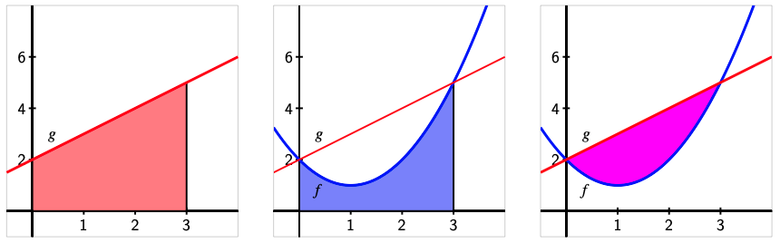

# Integral Tentu
## Integral Tentu untuk Menghitung Luas Daerah

Apabila ada dua buah formula yaitu $f(x)$ dan $g(x)$. Kita dapat menghitung luas daerah yang dibatasi kedua formula tersebut dengan cara:
1. Gunakan aljabar untuk menentukan titik-titik di mana grafik fungsi $f$ dan $g$ berpotongan
2. Gambarkan grafik $f$ dan $g$ pada diagram Kartesius
3. Temukan dan evaluasi ekspresi integral yang mewakili area di antara $y = f(x)$ dan sumbu $x$ pada interval di aantara titik-titik perpotongan $f$ dan $g$
4. Temukan dan evaluasi ekspresi integral yang mewakili area di antara $y = g(x)$ dan sumbu $x$ pada interval di aantara titik-titik perpotongan $f$ dan $g$

**Contoh Kasus**

Temukan area yang dibatasi oleh grafik $f(x) = (x-1)^2 + 1$ dan $g(x) = x + 2$

Dari ilustrasi di atas kita dapat melihat bahwa kedua grafik berpotongan di titik (0,2) dan (3,5). Kita dapat menghitung titik-titik perpotongan tersebut secara aljabar dengan memecahkan persamaan 

$y=x+2$ dan $y=(x-1)^2+1$ 

mensubstitusikan $y$ dengan $x+2$ di persamaan kedua menghasilkan 

$x+2=(x-1)^2+1$ 

sehingga 

$x+2 = x^2 - 2x + 1 + 1$

sehingga

$x^2 - 3x = x(x-3) = 0$

dengan demikian diperoleh bahwa $x = 0$ atau $x = 3$. Menggunakan $y = x + 2$, selanjutnya dapat diperoleh nilai $y$ pada titik perpotongan.

pada interval $[0,3]$, area di bawah $g$ adalah

$\int_0^3 (x+2)dx = \frac{21}{2}$,

sementara area di bawah $f$ untuk interval yang sama adalah

$\int_0^3 [(x-1)^2+1]dx = 6$,

Sehingga, area di antara kedua kurva adalah

$A = \int_0^3 (x+2)dx - \int_0^3 [(x-1)^2 + 1]dx = \frac{21}{2} - 6 = \frac{9}{2}$

