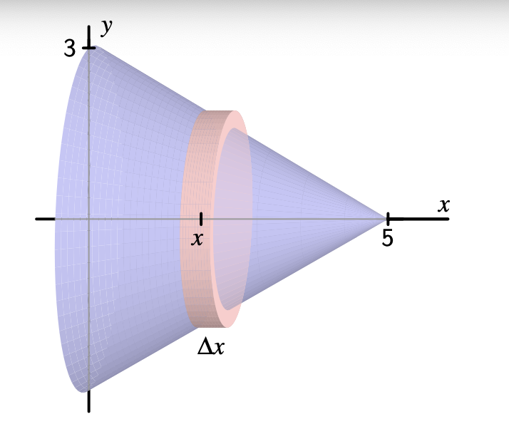

# Integral Tentu
## Integral Tentu untuk Menghitung Volume Benda Putar

Sebelumnya kita sudah mempelajari bagaimana integral tentu digunakan untuk menghitung luas daerah di antara dua kurva. Pendekatan yang sama bisa kita lakukan untuk menghitung volume suatu benda yang dibentuk oleh kurva.

Sebagaimana luas daerah, yang dihitung dengan menjumlahkan luas irisan-irisan berbentuk persegi panjang, kita dapat menghitung volume suatu benda putar dengan cara menjumlahkan volume irisan-irisannya yang berbentuk cakram atau cincin.

Sebagai contoh, diberikan benda putar sebagai berikut:

Benda di atas berbentuk kerucut, di mana kita ketahui bahwa volume kerucut dapat dihitung dengan formula 

$V_{kerucut} = \frac{1}{3}\pi r^2t$

Namun kita akan menggunakan pendekatan integral tentu untuk menghitung volume benda di atas, dengan langkah-langkah sebagai berikut:
1. Tentukan formula fungsi linear $y=f(x)$ yang digambarkan!
2. Untuk irisan yang digambarkan di atas dengan ketebalan $\Delta x$, berapa radiusnya? Perhatikan bahwa radius akan bergantung terhadap nilai $x$!
3. Berapa volume dari irisan yang digambarkan di poin (2) di atas?
4. Bagaimana bentuk integral tentu yang akan menjumlahkan setiap irisan dari $x=0$ hingga $x=5$?
5. Bandingkan hasilnya dengan menggunakan formula untuk menghitung volume kerucut!

### Menentukan formula fungsi linear
Untuk menentukan formula sebuah fungsi linear, kita perlu ketahui hubungan antara variabel independen $(x)$ dan variabel dependen $(y)$, biasanya dinyatakan dalam bentuk:

$y = mx + c$

Di mana:
- $m$: gradien atau kemiringan garis, yang menunjukkan tingkat perubahan $y$ terhadap $x$
- $c$: intercept $y$ (titik potong garis dengan sumbu $y$)

Gradien dapat dihitung dengan formula:

$m = \frac{y_2 - y_1}{x_2 - x_1}$

Dari diagram di atas, dapat kita hitung:

$m = \frac{3 - 0}{0 - 5}$

$m = -\frac{3}{5}$

Selanjutnya untuk mencari nilai $c$ kita substitusikan nilai $m$ dan salah satu titik dalam persamaan, misal kita gunakan $x = 0$ di mana nilai $y = 3$:

$3 = -\frac{3}{5}.0 + c$

$c = 3$

Dengan demikian kita peroleh persamaan linear lengkapnya yaitu

$y = -\frac{3}{5}x + 3$

### Menentukan radius setiap irisan
Radius $r$ setiap irisan adalah sama dengan nilai $y$ yang dinyatakan dengan fungsi linear $y = -\frac{3}{5}x + 3$ di atas.

### Menghitung volume setiap irisan
Setiap irisan merupakan tabung dengan ketebalan (tinggi) $t = \Delta x$ dan radiusnya $r = -\frac{3}{5}x + 3$.

Diketahui rumus volume tabung adalah

$V_{tabung} = \pi r^2t$

Sehingga untuk setiap irisan volumenya adalah

$V_{irisan} = \pi (-\frac{3}{5}x + 3)^2.\Delta x$

### Bentuk integral
Setiap irisan dari $x=0$ hinggal $x=5$ dijumlahkan menggunakan integral tentu sebagai berikut:

$V = \int_0^5 \pi (-\frac{3}{5}x + 3)^2 dx$

atau

$V = \pi\int_0^5(-\frac{3}{5}x + 3)^2 dx$

Kita ekspansikan $(-\frac{3}{5}x + 3)^2$ menjadi:

$(-\frac{3}{5}x +3)^2 = (-\frac{3}{5}x)^2 + 2(-\frac{3}{5}x)(3) + 3^2$

$=\frac{9}{25}x^2 - \frac{18}{5}x +9$

Sehingga integral untuk volumenya menjadi:

$V = \pi\int_0^5(\frac{9}{25}x^2 - \frac{18}{5}x +9) dx$

Dipisahkan menjadi tiga integral:

$V = \pi[\int_0^5\frac{9}{25}x^2 dx - \int_0^5 \frac{18}{5}x dx + \int_0^5 9 dx]$

Kita hitung integralnya satu persatu:

$\int_0^5\frac{9}{25}x^2 dx =\frac{9}{25} \int_0^5x^2 dx = \frac{9}{25}[\frac{x^3}{3}]_0^5 =\frac{9}{25}.\frac{125}{3}=\frac{1125}{75}=15$

$\int_0^5\frac{18}{5}x dx = \frac{18}{5}\int_0^5 x dx = \frac{18}{5}[\frac{x^2}{2}]_0^5=\frac{18}{5}.\frac{25}{2}=\frac{450}{10}=45$

$\int_0^59 dx = 9\int_0^5 1dx =9[x]_0^5 = 9(5)-9(0) = 45$

Sehingga

$V=\pi(15-45+45)$

$V=\pi.15 = 15\pi$ satuan kubik

### Perbandingan volume
$V_{kerucut} = \frac{1}{3}\pi r^2t$

di mana radiusnya adalah 3 dan tingginya adalah 5 sehingga

$V_{kerucut} = \frac{1}{3}\pi 3^2.5 = 15\pi$ satuan kubik

Sehingga terbukti bahwa perhitungan secara integral dan rumus volume kerucut memberikan hasil yang sama.

Secara umum untuk menghitung volume benda putar yang dibatasi oleh garis $x=a$ dan $x=b$ serta kurva $y=f(x)$ yang diputar $360^o$ terhadap sumbu $x$ dapat digunakan formula sebagai berikut:

$$V = \pi\int_a^b f^2(x).dx$$

Metode ini dikenal sebagai metode **cakram**.